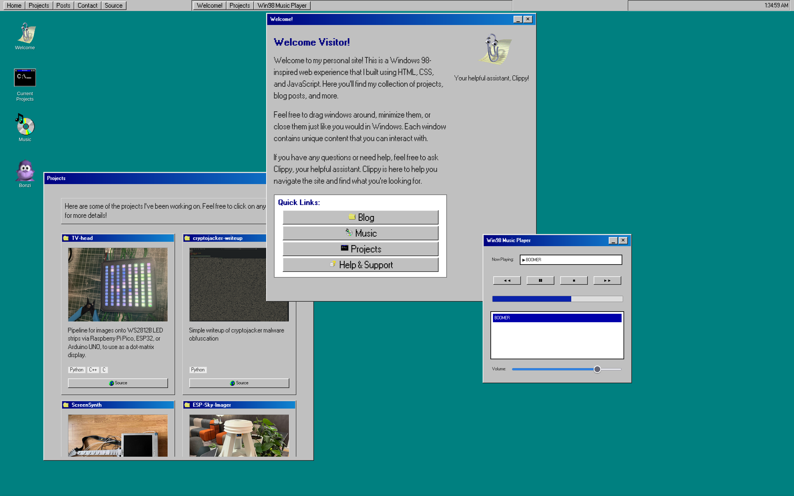

# Devinci.Cloud



This is the frontend component of personal portfolio website, devinci.cloud. The site is modeled after a Windows 98 desktop, complete with a start menu, taskbar, and desktop icons. The site components are built purely as ES6 modules, and bundled using Vite.

Styling for the windows components is done using the [98.css](https://jdan.github.io/98.css/) package for consistency.

The Server component of the site is a custom minimal Flask server and sqlite database, available [here](https://github.com/sudoDeVinci/devincicloud-backend). 

# Usage

I have defined a number of npm script keywords in the `package.json` file to make it easier to run the site locally. Eg. `npm run build` will build the site using Vite via `vite build`, and `npm run serve` will start a local server to serve the site via `vite preview`.

```json
"scripts": {
        "http-server": "npx http-server -p 9001",
        "dev": "vite",
        "build": "vite build",
        "serve": "vite preview",
        ...
        "clean-all": "npm run clean && rm -rf node_modules/ && rm -f package-lock.json"
    },
```

If you'd like to run this site locally, you can do so by cloning the repository and running the following:

1. Install dependencies
    ```bash
    npm install
    ```

2. Build the site using Vite
    ```bash
    npm run build
    ```

3. Start the server
    ```bash
    npm run serve
    ```

# The Window Manager

`Windows` and other visual objects in our app like `Icons` sit inside and are managed by the `Environment` class.
The Enviornment as an object in the DOM is just a div which spans the entirety of the viewport and doesn't scroll. The Environment as a Javascript class manages and manipulates the objects viewable to the user.

The Environment is of course made of the different parts which makes up a desktop, viewable below.


In each label, from top to bottom you're given
1. The name of the piece
2. The CSS class/ID name
3. The attribute name within the Envionment class

When creating a new Envionment, you just declare a new instance. Environment takes no arguments.

```js
const env = new Environment()
```

# Windows

`Windows` as objects in the DOM are divs inside the `Environment` with a `fixed` position css style and a hidden overflow.
A `Window` as a Javascript class holds the contents of a single page of our site. It's draggable, exitable, minimizable, resizable, and can be hidden behind other windows.

The Window is made of different parts much like the Environment, though they are much less complex.


<br>

## Window Configs

Since Windows are simply divs, our main way of controlling them is changing their CSS properties in response to actions. For windows, there are a number of these key values we care about which are defined within the `WindowConfig`:

    - width - Window width in pixels
    - height - Window height in pixels
    - title - Window title visible in top left
    - content - The HTML content inside the window being displayed.
    - zIndex - The z-index (depth-posiiton) of the window.
    - isMinimized - whether the window is minimized.
    - icon - A oath to the icon image for the window.
    - x position - The x position of the window on screen in pixels.
    - y posiiton - The y position of the window on screen in pixels.

Windows can be created with the `newWindow` method of the `Environment`.
When creating a `Window`, we pass the `Window` sub-class type as well as a `WindowConfig`
object to style and set the state of our window. This is as simple as:

```js
const env = new Environment()

const config = {
    height: 300,
    width: 400,
    icon: '🔥',
    title: 'Environment Test',
    content: '<p>This is a test</p>'
}

env.newWindow(Window, config)
```

This for example, creates the following:


we can also set window positions, and their z-index.

```js
const env = Environment(true)

const config = {
    height: 150,
    width: 1000,
    x: 2000,
    y: 500,
    title: "Other testing window",
    content: "<p> Nothing to see here people </p>" 
}

env.newWindow(Window, config)
```

The most basic window types each have a default `WindowConfig` within the `Environment`. These are stored within the `Environment.windowTypes` Map.
This is a mapping of `Window` sub-types to their default configs
```js
 /**
 * @property {typeof Window, WindowConfig>} windowTypes - The types of windows that can be created
 */
this.windowTypes = new Map([
    [Window.name, {
    width: 600,
    height: 400,
    icon: '',
    title: 'Window',
    content: '',
    styles: {},
    events: {},
    savedstate: {}
    }],
```

You however, can create your own window subtypes, and use the `Environment.newWindow` to use it.
Since there is no default config for your new window sub-type, the first config you ever pass to `newWindow` will become that default.

It's important to note that if only some fields in your `WindowConfig` are defined, the rest will be taken from the known default within the `Environment.`

So we could create our own `Window` subclass on a file called `customwindow.js`

```js
import {Window} from './window.js'
/** @import {WindowConfig} from './Window.js' */

class CustomWindowClass extends Window {
    ...
}
```

Then from our main script file, we add this via `Environment.newWindow`.

```js
import Environment from './environment.js'
import {CustomWindowClass} from './Windows/customwindow.js'
/** @import {WindowConfig} from './Windows/window.js' */

// Create environment with autoRestore true
const env = new Environment(true)

/**
 * Create a new window with the following configuration
 * @type {WindowConfig}
 */
const config = {
    height: 300,
    width: 400,
    icon: null,
    title: 'Environment Test',
    content: '<p>This is a test</p>'
}

env.newWindow(CustomWindowClass, config)
```

# The Window Class

The Window class isn

## TODO
- [x] Add more custom window types
- [ ] Add option to stop windows from being exitable
- [x] Add music window
- [x] Add project window
- [ ] Add contact window 
- [x] Add more icons
- [x] Make clock realtime